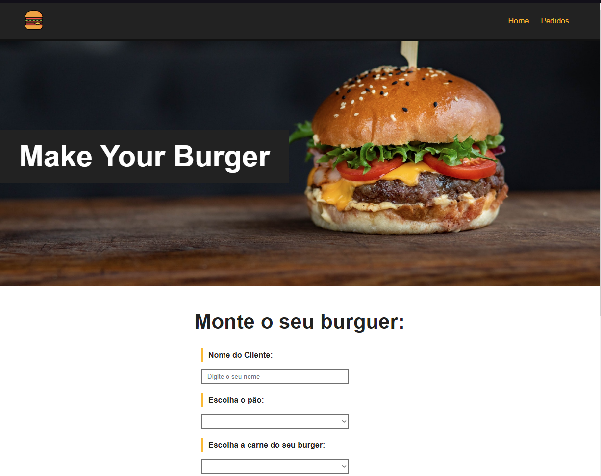

  

 
# O que é o Make Your Burguer?
 O Make Your Burger é um projeto de emissão e gerenciamento de pedidos, desenvolvido em Vue.js + Typescript e Vite, com conceitos de componentização e requisições HTTP 
## Features
<ul>
  <li>Leitura de todos os Pedidos</li>
  <li>Criação de Novos Pedidos</li>
  <li>Alteração de Status de Pedidos Existentes</li>
  <li>Cancelar Pedido</li>
</ul>

## Tecnologias
 

  <ul>
    <li><a href="https://v3.vuejs.org">Vue.js 3</a></li>
    <li><a href="https://vitejs.dev">Vite</a></li>
    <li><a href="https://www.typescriptlang.org">Typescript</a></li>
    <li><a href="https://www.npmjs.com/package/json-server">Json Server</a></li>
  </ul>
 

## Créditos
Este Projeto foi desenvolvido baseado no curso de Vue.js 3 do <strong>Matheus Battisti</strong> <a href="https://youtu.be/CtVhIITICF8">clique</a>

